# 操作系统概念

操作系统位于用户与计算机硬件之间。操作系统是管理计算机硬件的软件。

## 第一章 导论

**操作系统**是管理计算机硬件的程序，充当计算机用户和硬件的中介。

> 我们的目标：
>
> 1. 描述计算机系统的基本组成
> 2. 概述操作系统的组件
> 3. 概述多种类型的计算环境
> 4. 探讨多个开源的操作系统

### 1.1 操作系统的功能

计算机系统可以粗分为4个组件：硬件、操作系统、应用程序和用户。

硬件：如中央处理单元(CPU)、内存(memory)、输入/输出设备(I/O device)。提供基本的计算资源。

用户程序：规定了用户为解决计算问题而使用这些资源的方式。

操作系统：控制硬件。

计算机系统可以分为硬件、软件和程序。

#### 1.1.1 用户视角

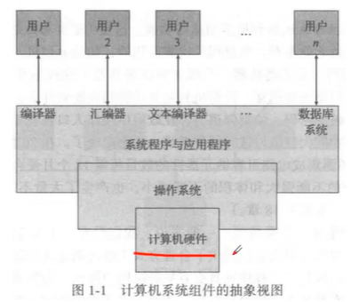

PC用户：操作系统设计的主要目的是用户**使用方便**，次要的方便，不在乎资源利用。

操作系统是一个桥梁，管理硬件。

不同的其他视角：

1.大型机小型机相连：优化资源利用率。

2.工作站与服务器相连：兼顾使用方便性和资源利用率。

3.移动设备的普及：通过触摸屏交互。

4.嵌入式设备：家电和汽车等嵌入式计算机。

#### 1.1.2 系统视角

操作系统可被视为资源分配器。

稍微不同的另一个视角是：强调控制各种I/O设备和用户程序的需求。**控制程序**管理用户程序的执行，以防止计算机资源的错误或不当使用。它特别注重I/O设备的运行和控制。

#### 1.1.3 操作系统的定义

前言：

20世纪60年代，摩尔定律预测集成电路可容纳元器件的数目每隔18个月便会翻倍。

公认的定义：管理计算机硬件与软件资源的计算机程序。

通常称为**内核**：系统程序和应用程序。

### 1.2 计算机系统的组成

#### 1.2.1 计算机系统的运行

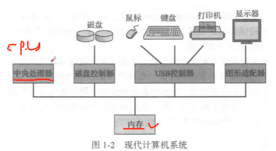

现代通用计算机包括一个或多个CPU和若干设备控制器，通过公用总线相连而成。总线提供了共享内存的访问。

通过内存控制器协调访问内存。

引导程序：开机时，需要运行一个初始程序，该程序位于计算机的固件(如只读内存ROM或电可擦编程只读内存EEPROM)。引导程序必须知道如何加载操作系统并开始执行系统。

引导程序要知道如何加载操作系统并开始执行系统。为了完成这一目标，引导程序必须定位操作系统内核并加载到内存。

一旦内核加载到内存并执行，它开始为系统与用户提供服务。系统程序也提供一些服务，它们在启动时加到内存而成为系统进程或系统后台程序。

事件发生通过**中断**来通知。软件可以通过**系统调用**触发中断。

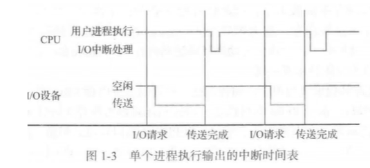

当CPU被打断，CPU停止正在做的事，并立即转到固定位置再继续执行。该固定位置通常包含中断服务程序的开始地址。中断服务程序开始执行，在执行完后，CPU重新执行中断的计算。

中断是计算机体系结构中重要组成部分。中断应将控制转移到合适的中断服务程序。通常，指针表位于低地址内存。这些位置包含各种设备的中断处理程序的地址。这种地址的数组或中断向量，可以通过唯一的设备号来索引。

中断体系结构也应保存中断指令的地址。许多以前的设计只是简单地将中断地址保存在某个固定位置或可用设备号来索引的位置。现代体系结构将返回地址保存在系统堆栈上。如果中断程序需要修改处理器状态，如修改寄存器的值，则应明确保存当前状态，并在返回之前恢复该状态。处理中断后，保存的返回地址会加载到程序计数器。

#### 1.2.2 存储结构

内存：随机访问内存(RAM)，内存通常动态随机访问内存(DRAM)，采用半导体技术实现。

只读内存：ROM，数据不可修改，不可写。

电可擦可编程只读内存：EEPROM，可以修改，但是不能经常修改，可保存大部分静态程序。应用：智能手机。

内存特点：易丢失，掉电丢失数据。

外村：非易失性，数据可持久化。

内存提供字节数组，字节都有地址。通过`load`或`store`实现。指令`load`将内存字节或字保存到CPU寄存器，而指令`store`将寄存器内容保存到内存。

在冯·诺依曼体系结构（von Neumann architecture)上执行时，一个典型的指令执行周期是，首先从内存中获取指令，并存到指令寄存器( instruction register)。接着，该指令被解码，也可能会从内存中获取操作数据并且存到内部寄存器。在指令完成对操作数据的执行后，结果也可存到内存。

> 注意:内存单元只能看到内存地址的流，而并不知道它们如何产生(通过指令计数器、索引、间接、常量地址或其他方式)或它们是什么样(指令或数据）的地址。相应地，我们可以忽略程序如何产生内存地址，而只关注由程序运行所生成的地址序列。

程序和数据不可能永久驻留在内存中：内存太少或者内存易失性。

所以需要**外存**。

外存设备：磁盘，硬盘，高速缓存，CD-ROM，磁带等。程序执行时才加载到内存。各个存储系统差异在于速度、价格、大小和易失性等。

易失存储会丢失内容；非易失性存储不易丢失。

**固态磁盘：**非易失性，一般比磁盘块。

固态磁盘(solid-state disk)有多种类型，一般来说都比磁盘要快，也是非易失的。一种类型的固态磁盘在运行时将数据保存在一个大的DRAM数组上，它有一个隐藏磁盘和一个作为备份电源的电池。当外部电源被中断时，固态磁盘控制器将数据从RAM复制到磁盘。当外部电源恢复后，控制器将数据复制到RAM。另一种固态磁盘是**闪存**，它在照相机、个人数字助理(Personal Digital Assistant，PDA)和机器人中很受欢迎，并越来越多地作为通用计算机的存储。闪存比DRAM慢，但是无需电源以便保存内容。另一种非易失性存储器是NVRAM，即具有备用电池的DRAM。这种存储与DRAM一样快，且是非易失的(只要电池有电)。

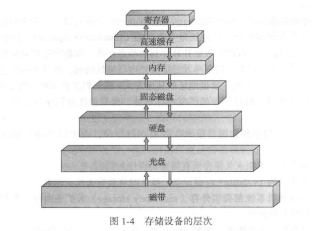

#### 1.2.3 I/O结构

每个通用计算机系统由一个CPU和多个设备控制器组成，它们通过共同总线连在一起。每个设备控制器管理某一特定类型的设备。根据设备控制器的特性，可以允许多个设备与其相连。例如，**小型计算机系统接口**（Small Computer System Interface，SCSI)控制器可连接7个或更多的设备。每个设备控制器维护一定量的本地缓冲存储和一组特定用途的寄存器。设备控制器负责在所控制的外围设备与本地缓冲存储之间进行数据传递。

通常，操作系统为每个设备控制器提供一个**设备驱动程序**( device driver)。该设备驱动程序负责设备控制器,并且为操作系统的其他部分提供统一的设备访问接口。

在开始IO时，设备驱动程序加载设备控制器的适当寄存器。相应地，设备控制器检查这些寄存器内容，以便决定采取什么操作（如“从键盘中读取一个字符”)。控制器开始从设备向本地缓冲区传输数据。一旦完成数据传输，设备控制器就会通过中断通知设备驱动程序，它已完成了操作。然后，设备驱动程序返回控制到操作系统。对于读操作，数据或数据指针也会返回;而对于其他操作，设备驱动程序返回状态信息。

通过**直接内存访问DMA**，为设备控制器可在本地缓冲和内存之间传送整块的数据，而无需CPU的干预。每块只能产生一个中断。

一些高端系统采用交换而不是总线结构。在这些系统中，多个组件可以与其他组件同时对话，而不是竞争公共总线的周期，此时的DMA更为有效。

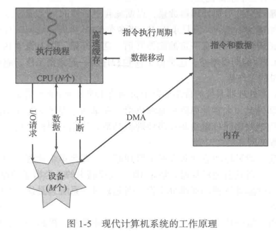

### 1.3 计算机系统的体系结构

#### 1.3.1 单处理器系统

直到最近，大多数系统仍采用单处理器。单处理器系统只有一个主CPU，以便执行一个通用指令集，该指令集包括执行用户进程的指令。几乎所有单处理器系统都带有其他专用处理器。它们或为特定设备的处理器，如磁盘、键盘、图形控制器;或为更通用的处理器,如在系统组件之间快速移动数据的I/O处理器。

所有这些专用处理器执行**有限指令集**，**而并不执行用户进程**。在有的环境下，它们由操作系统来管理，此时操作系统将要做的任务信息发给它们，并监控它们的状态。例如，磁盘控制器的微处理器接收来自主CPU的一系列请求，并执行自己的磁盘队列和调度算法。这种安排使得主CPU不必再执行磁盘调度。PC的键盘有一个微处理器来将击键转换为代码,并发送给CPU。在其他的环境下，专用处理器作为低层组件集成到硬件。操作系统不能与这些处理器通信，但是它们可以自主完成任务。专用处理器的使用十分常见，但是这并不能将一个单处理器系统变成多处理器系统。如果系统只有一个通用CPU，那么就为单处理器系统。

#### 1.3.2 多处理系统

多处理器系统，也称为并行系统或多核系统。这类系统有两个或多个紧密通信的CPU，共享计算机总线、时钟、内存和外设。

优点：

1. 增加吞吐量：增加处理器数量；采用N个处理器加速比小于N。
2. 规模经济：多处理器系统价格小于相同功能多个单个处理器系统的价格，因为前者可以共享。
3. 增加可靠性：关于失灵。

**适度退化：**根据剩余有效硬件的级别按比例继续提供服务的能力。

有的系统超过适度退化，称为**容错**，因为它们能够容忍单个部件错误，并且仍然继续运行。

**非对称处理：**每个处理器有各自特定的任务。

> 主从关系：一个主处理器控制系统，其他处理器或者向主处理器要任务或做预先规定的任务。主处理器调度从处理器，并安排工作。

**对称多处理(Symmetric MultiProcessing,SMP)**：每个处理器都参与完成操作系统的所有任务。SMP表示所有处理器对等，处理器之间没有主从关系。每个处理器都有自己的寄存器集，也有私有或本地缓存。所有处理器都共享物理内存。SMP的一个例子是AIX，这是IBM设计的一种商用版UNIX。每个AIX系统可以配有多个处理器。

优点：许多进程可以同时执行。各个CPU互相独立，通过共享一定的数据结构可以避免低效。

例子：现代操作系统都支持SMP

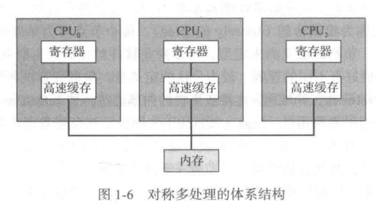

多处理通过增加CPU提高计算能力。多处理可使系统的内存访问模型，从均匀内存访问UMA改成非均匀内存访问NUMA。对UMA，CPU访问RAM的所需时间相同；对于NUMA，有的内存访问的所需时间更多。

CPU设计的最新趋势是：集成多个计算核到单个芯片(多核)。更高效，消耗低。

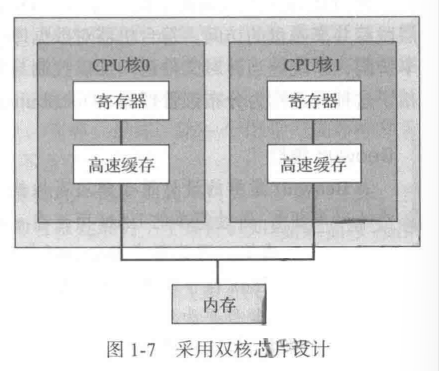

每个核都有自己的寄存器和本地缓存。这些多核CPU对于操作系统就像N个标准处理器。

> 刀片服务器：[刀片服务器 - 维基百科，自由的百科全书 (wikipedia.org)](https://zh.m.wikipedia.org/zh-hans/刀鋒伺服器)：一种单板型态的伺服器，于2001年由[RLX](https://zh.m.wikipedia.org/w/index.php?title=RLX&action=edit&redlink=1)公司提出。

#### 1.3.3 集群系统

集群系统：另一类型的多处理器系统是集群系统。

集群系统由两个或多个独立系统组成，这样的系统称为**松耦合的**。每个节点可为单处理器系统或多核系统。

公认的定义：集群计算机共享存储，并且采用LAN (Local Area Network，局域网）连接或更快的内部连接，如 InfiniBand。

集群通常用于提供高可用性( high availability)服务，这意味着即使集群中的一个或多个系统出错，仍可继续提供服务。一般来说，通过在系统中增加一定冗余，可获取高可用性。每个集群节点都执行集群软件层，以监视（通过局域网)一个或多个其他节点。如果被监视的机器失效，那么监视机器能够取代存储的拥有权，并重新启动在失效机器上运行的应用程序。应用程序的用户和客户只会感到短暂的服务中止。

集群可以是对称的，也可以是非对称的。对于**非对称集群**(asymmetric clustering)，一台机器处于**热备份模式**( hot-standby mode)，而另一台运行应用程序。热备份主机只监视活动服务器。如果活动服务器失效，那么热备份主机变成活动服务器。对于对称集群(symmetricclustering)，两个或多个主机都运行应用程序，并互相监视。由于充分使用现有硬件，当有多个应用程序可供执行时,这种结构更为高效。

每个集群由通过网络相连的多个计算机系统组成，也可提供**高性能计算**(high-performance computing)环境。每个集群的所有计算机可以并发执行一个应用程序，因此与单处理器和SMP系统相比，这样的系统能够提供更为强大的计算能力。当然，这种应用程序应当专门编写，才能利用集群。这种技术称为**并行计算**( parallelization)，即将一个程序分成多个部分，而每个部分可以并行运行在计算机或集群计算机的各个核上。通常，这类应用中的每个集群节点解决部分问题，而所有节点的计算结果合并在一起，以便形成最终解决方案。

其他形式的集群还有并行集群和**WAN ( Wide-Area Network)集群**。并行集群允许多个主机访问共享存储的同一数据。由于大多数操作系统并不支持多个主机同时访问数据，并行集群通常需要由专门软件或专门应用程序来完成。例如，Oracle Real Application Cluster就是一种可运行在并行集群上的、专用的Oracle数据库。每个机器都运行Oracle，而且软件层跟踪共享磁盘的访问。每台机器对数据库内的所有数据都可以完全访问。为了提供这种共享访问，系统应当针对文件访问加以控制与加锁，以便确保没有冲突操作。有的集群技术包括了这种通常称为**分布锁管理器**（Distributed Lock Manager，DLM)的服务。

> Beowulf集群
>
> Beowulf集群的设计用于解决高性能的计算任务。每个 Beowulf集群由商用硬件（如个人计算机)，通过简单的LAN而连在一起。这种集群无需特定软件包，每个节点采用开源软件库来通信。因此每个 Beowulf集群的构成方法有很多。通常，每个 Beowulf计算节点都运行Linux操作系统。由于并不要求专门硬件而只采用免费的开源软件，构成这种高性能计算的集群更为经济。实际上，有的Beowulf集群采用数百台遗弃的计算机，以便解决大运算量的科学计算问题。

集群技术发展迅速。有的集群产品支持数十个系统，而且集群节点也可分开数公里之远。**存储域网**(Storage-Area Network，SAN)的出现也改进了集群性能;如12.3.3节所述,SAN可让许多系统访问同一存储池。SAN可以存储应用程序和数据，集群软件可将应用程序交给SAN的任何主机来执行。如果主机出错，那么其他主机可以接管过来。对于数据库集群，数十个主机可以共享同一数据库，从而大大提升了性能和可用性。图1-8显示了一个集群的通用结构。

### 1.4 操作系统的结构

操作系统最重要的能力：**多道程序设计**，为了提高CPU利用率。

操作系统在内存中同时保存多个任务。由于贮存太小不能容纳所有作业，因此这些作业首先保存在磁盘的作业池上。作业池上包括磁盘上的、等待分配内存的所有进程。

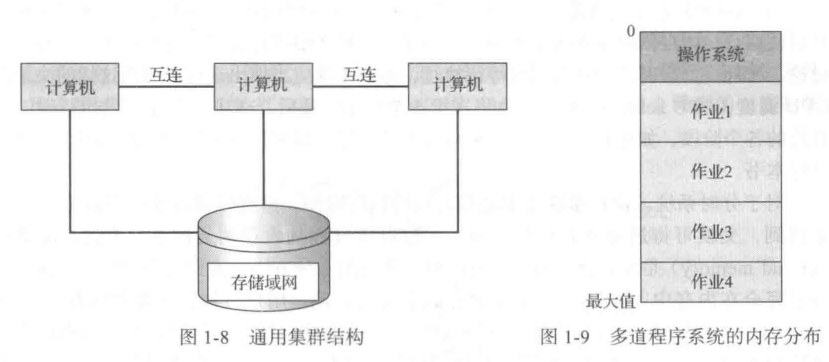

内存的作业集为作业池的作业集的一个子集。只要有一个任务可以执行，CPU就不会空闲。

**分时系统**是多道程序设计的自然延伸。

分时系统要求计算机可交互，响应时间要短。

分时操作系统采用CPU调度和多道程序设计，为每个用户提供一小部分的分时计算机资源。**每个用户至少有一个程序在内存中。加载到内存并执行的程序，通常称为进程( process)**。当进程执行时，它通常在执行较短的一段时间后，要么完成，要么需要进行IО操作。I/O可以是交互的，即输出是到用户显示器，输入来自用户键盘、鼠标或其他设备。由于交互IO通常按人类速度（ people speed)来进行，因此可能需要很长时间完成。例如，输入通常受限于用户打字速度，每秒7个字符对人类来说可能很快，但是对计算机来说太慢了。在用户进行交互输入时，操作系统为了不让CPU空闲，会将CPU切换到其他用户程序。

**作业调度：**系统对作业做出选择。从作业池中选出一个作业，并将它调入内存。内存同时包括多个程序。

**交换**：可将进程从磁盘调入内存，也可将进程从内存调到磁盘。

**虚拟内存：**是实现合理响应时间的更为常用的一种方法，虚拟内存允许一个执行作业不必完全在内存中。优点：用户可执行比物**理内存( physicalmemory)大的程序**。再者，它将内存抽象成一个庞大的、统一的存储数组，将用户理解的逻辑内存( logical memory)与真正的物理内存区分开来。这种安排使得程序员不受内存空间的限制。

### 1.5 操作系统的执行

现代操作系统是**中断驱动**的。事件由中断或者陷阱引起。

陷阱/异常：软件生成的中断，或源于出错，或源于用户程序的特定请求。

由于系统和用户共享计算机系统地硬件和软件，一个程序的bug可能会对其他进程造成不利影响。

#### 1.5.1 双重模式和多重模式的执行。

区分操作系统代码和用户代码的执行。

至少需要两种单独运行模式:**用户模式**(user mode)和**内核模式**(kernel mode)(也称为*监视模式*（ supervisor mode)、*系统模式*( system mode)或*特权模式*( privileged mode))。计算机硬件可以通过一个**模式位**(mode bit)来表示当前模式:内核模式(0）和用户模式(1)。有了模式位，就可区分为操作系统执行的任务和为用户执行的任务。当计算机系统执行用户应用时，系统处于用户模式。然而，当用户应用通过系统调用，请求操作系统服务时，系统必须从用户模式切换到内核模式，以满足请求，如图1-10所示。正如将会看到的，这种架构改进也可用于系统操作的许多其他方面。

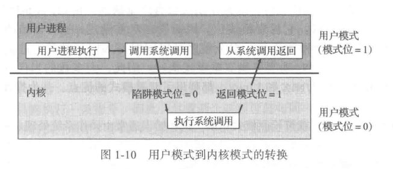

当系统引导时，硬件从内核模式开始。操作系统接着加载，然后开始在用户模式下执行用户程序。一旦有陷阱或中断，硬件会从用户模式切换到内核模式(即将模式位的状态设为0 )。因此，**每当操作系统能够控制计算机时，它就处于内核模式。在将控制交给用户程序前，系统会切换到用户模式(将模式位设为1)**。

双重模式执行提供保护手段，以便防止操作系统和用户程序受到错误用户程序的影响。这种防护实现为:将可能引起损害的机器指令作为特权指令(privileged instruction)，并且硬件只有在内核模式下才允许执行特权指令。如果在用户模式下试图执行特权指令，那么硬件并不执行该指令，而是认为该指令非法，并将其以陷阱形式通知操作系统。

模式概念可以拓展。**支持虚拟化技术的CPU有一种单独模式**，用于表示**虚拟机管理器**(Virtual Machine Manager, VMM)是否正在控制系统。这种模式的特权要多于用户模式，但少于内核模式。这种特权模式可以改变CPU状态，以便创建和管理虚拟机。有时，不同的内核组件也会使用不同模式。需要注意的是，除了模式外，CPU设计人员也可采用其他方式来区分执行特权。例如，Intel 64系列的CPU有四种特权级别( privilege level)并支持虚拟化,但是没有一个特定的虚拟化模式。

现在看一看计算机系统的指令执行的生命周期。最初，操作系统进行控制，这时指令执行在内核模式。当控制转交到一个用户应用时，模式也设置为用户模式。最终，通过中断、陷阱或系统调用,控制又返回到操作系统。

系统调用为用户程序提供手段，以便请求操作系统完成某些特权任务。系统调用可有多种方式，取决于底层处理器提供的功能。不管哪种，它都是进程请求操作系统执行功能的方法。系统调用通常会陷入中断向量的某个指定位置。这一般可由通用trap指令来完成，不过也有的系统(如MIPS系列)由专用syscall指令来完成系统调用。

当要执行系统调用时，硬件通常将它作为软件中断。控制通过中断向量转到操作系统的中断服务程序，并且模式位也设为内核模式。系统调用服务程序是操作系统的一部分。内核检查中断指令，判断发生了什么系统调用;参数表示用户程序请求何种服务。请求所需的其他信息可以通过寄存器、堆栈或内存(内存指针也可通过寄存器传递)来传递。内核首先验证参数是否正确和合法，然后执行请求，最后控制返回到系统调用之后的指令。2.3节将更加详细地描述系统调用。

如果双重模式没有硬件支持，则操作系统会有严重缺点。例如，MS-DOS是为Intel8088体系结构而编写的，它没有模式位，因而没有双重模式。运行出错的程序可以通过写入数据而清除整个操作系统，多个程序可以同时写入同一设备，进而可能引起灾难结果。现今的Intel CPU确实提供双重模式执行。因此，大多数的当代操作系统，如Microsoft Windows 7、UNIX和 Linux，都利用了双重模式的优点，并为操作系统提供了更强保护。

一旦硬件保护到位，就可检测模式错误。这些错误通常由操作系统处理。如果一个用户程序出错，如试图执行非法指令或者访问不属于自己的地址空间内存，则通过硬件陷到操作系统。陷阱如同中断一样，通过中断向量可将控制转到操作系统。当一个程序出错时，可由操作系统来异常终止。这种情况的处理代码与用户请求的异常终止一样。操作系统会给出一个适当的出错信息，并倒出(dump)程序内存。倒出内存信息通常写到文件，这样用户或程序员可检查它,纠正错误并重新启动程序。

#### 1.5.2 定时器

定时器：操作系统应该维持控制CPU，防止用户程序陷入死循环，或不调用系统服务并且不将控制返给操作系统。

定时器可设置为在指定周期后中断计算机。指定周期可以是固定的/

**可变定时器:**一般通过一个固定速率的时钟和计数器来实现。

操作系统设置计数器。每次时钟滴答时，计数器都要递减。

在将控制交到用户之前，操作系统确保定时器已设置好以便产生中断。当定时器中断时，控制自动转到操作系统，而操作系统可以将中断作为致命错误来处理，也可以给予用户程序更多时间。当然，用于修改定时器的指令是特权的。

定时器可以防止用户程序运行过长。一种简单方法是，采用程序允许执行的时间来初始化计数器。例如，能运行7分钟的程序可以将计数器设置为420。定时器每秒产生一次中断，计数器相应递减1。只要计数器的值为正，控制就返回到用户程序。当计数器的值为负时，操作系统就会中止程序执行，因为它超过了设置的时间限制。

### 1.6 进程管理

进程：执行的程序。

进程为了完成任务，需要一定的资源，包括CPU时间、内存、文件、IO设备等。这些资源可以在进程创建时赋予，也可以在执行进程时分配。除了创建时得到的各种物理和逻辑资源外，进程还可以接受传输过来的各种初始化数据(输人)。例如，考虑这样一个进程,它要在终端或者屏幕上显示文件状态，而且需要有一个文件名作为输入。文件名的获得和信息的终端显示，可以通过适当指令和系统调用来进行。当进程中止时，操作系统就会收回所有可再利用的资源。

需要强调的是，**程序本身不是进程，程序是个被动实体( passive entity)，如同存储在磁盘上的文件内容，而进程是个主动实体（ active entity)**。单线程进程有一个程序计数器( program counter)，指定了下一个所要执行的指令(第4章讨论线程)。这样一个进程的执行应是顺序的。CPU一个接着一个地执行进程的指令，直至进程完成。再者，在任何时候,**每个进程最多只能执行一条指令**。因此，尽管两个进程可能与同一个程序相关联，然而这两个进程都有各自的执行顺序。多线程进程有多个程序计数器，每一个指向下一个给定线程需要执行的指令。

**进程是系统的工作单元。系统由多个进程组成，其中有的是操作系统进程（执行系统代码)，其他的是用户进程(执行用户代码)。所有这些进程都会并发执行，例如通过在单CPU上采用多路复用来实现。**

操作系统负责进程管理的以下活动:

+ 在CPU 上调度进程和线程
+ 创建和删除用户进程和系统进程
+ 挂起和重启进程
+ 提供进程同步机制
+ 提供进程通信机制

### 1.7 内存管理

正如1.2.2节所述，内存是现代计算机系统执行的中心。内存是一个大的字节数组，大小从数十万到数十亿。**每个字节都有地址。内存是个快速访问的数据仓库，并为CPU和IO设备所共享**。**中央处理器在获取指令周期时从内存中读取指令，而在获取数据周期时对内存数据进行读写(在冯·诺依曼架构上)。内存一般是CPU所能直接寻址和访问的、唯一的、大容量的存储器。**例如，如果 CPU需要处理磁盘数据，那么这些数据必须首先通过CPU产生的I/O调用传到内存。同样，如果 CPU需要执行指令，那么这些指令必须在内存中。

**如果一个程序需要执行，那么它必须映射到绝对地址，并且加载到内存。**随着程序执行，**进程可以通过产生绝对地址来访问内存的程序指令和数据。最后，程序终止，它的内存空间得以释放，这样下一个程序可以加载并得以执行。**

为改进CPU的利用率和用户的计算机响应速度，通用计算机应在内存中保留多个程序，这就需要内存管理。内存管理的方案有许多。这些方案会有各种具体方法，所有特定算法的效率取决于特定情景。在选择某个特定系统的内存管理方案时，必须考虑许多因素，尤其是系统的硬件设计。每个算法都要求特定的硬件支持。
操作系统负责内存管理的以下活动:

+ 记录内存的哪部分在被使用以及被谁使用。
+ 决定哪些进程(或其部分）会调入或调出内存。
+ 根据需要分配和释放内存空间。

### 1.8 存储管理

文件：OS对存储设备的物理属性进行抽象，并定义逻辑存储单元。操作系统映射文件到物理媒介，并通过存储设备来访问文件。

#### 1.8.1 文件系统管理

计算机可在多种类型的物理介质上存储信息，常用的有磁盘、光盘和磁带等。每个介质都由一个设备来控制，如磁盘驱动器或磁带驱动器。

文件是创建者定义的相关信息组合。文件内容为程序和数据。数据文件可以是数值、字符等。文件可以没有格式或者严格格式。

操作系统管理大容量存储介质，如磁盘和此带。

OS负责文件管理以下活动：

+ 创建、删除文件
+ 创建、删除目录
+ 提供文件和目录的操作原语
+ 映射文件到外村
+ 备份文件到稳定存储介质

#### 1.8.2 大容量存储器管理

因为内存较小、掉电会失去数据，所以计算机系统应该提供外存以备份内存。

主要的线存储介质：硬盘。

OS负责硬盘管理以下活动：

+ 空闲空间管理
+ 存储空间分配
+ 硬盘调度

外存使用应该更高效一点。

三级存储：磁带驱动器及其磁带、CD/DVD驱动器及光盘。分为一次写多次读和读-写。

#### 1.8.3 高速缓存

高速缓存也简称为缓存。

工作原理：信息通常保存在一个存储系统中(如内存)，使用时，它会被临时复制到更快存储系统，即高速缓存;当需要特定信息时，首先检查它是否处于高速缓存，如果是，可以直接使用高速缓存的信息，如果否，就使用位于源地的信息，同时将其复制到高速缓存以便下次再用。

可编程内部寄存器为内存提供高速缓存。程序员通过寄存器分配与寄存器替换的算法，决定哪些信息应在寄存器中而哪些应存在内存中。

高速缓存完全通过硬件实现。大多数系统都有一个指令的高速缓存。

所以高速缓存管理的设计很重要。

内存可以看作外存的高速缓存，这是因为外存数据应先复制到内存以便使用，而且数据应位于内存中才可保存到外存。永久驻留在外存上的文件系统的数据，会位于存储层次的多个层次上。在最高层上，操作系统可在内存中保存一个文件系统数据的高速缓存。另外，**固态盘也可作为高速存储**，并可通过文件系统接口来访问。大容量的外存为磁盘。磁盘存储又通常可以用磁带或移动磁盘来备份数据，以防止因磁盘损坏造成的数据丢失。有的系统将位于磁盘上的旧文件数据自动备份到三级存储，如磁带塔，以便降低存储费用(参见第12章)。

存储层次间的信息移动可以是显式的，也可以是隐式的，这取决于硬件设计和操作系统的控制软件。例如，高速缓存到CPU或寄存器的数据传递，通常通过硬件完成，无需操作系统干预。相反，磁盘到内存的数据传递通常通过操作系统控制。

在层次存储结构中，同一数据可能出现在存储系统的不同层次上。例如，位于文件B的整数A需要加1，而文件B位于磁盘。加1操作这样进行:先进行IO操作以将A所在的块调入内存。之后，A被复制到高速缓存和内部寄存器。这样，A的副本出现在多个地方:磁盘上、内存中、高速缓存中、内部寄存器中(见图1-12)。一旦在内部寄存器中执行加法后，A的值在不同存储系统中就会不同。只有在A的新值从内部寄存器写到磁盘时，A的值才会一样。

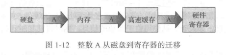

高速缓存一致性：带有本地的高速缓存。

#### 1.8.1 I/O系统

操作系统的目的之一是为用户隐藏具体硬件设备的特性。例如，在UNIX系统中，IO子系统（IO subsystem)为操作系统本身隐藏了IO设备的特性。I/O子系统包括以下几个组件:

+ 包括缓冲、高速缓存和假脱机的内存管理组件。

+ 设备驱动器的通用接口。

+ 特定硬件设备的驱动程序。

  只有设备驱动程序才能知道控制设备的特性。

### 1.9 保护与安全

内存寻址硬件确保一个进程仅可在自己的地址空间内执行。

**保护**是一种机制，用于控制进程或用户访问计算机系统的资源。保护安全要求系统能够区分所有用户。

UID：用户标识。

### 1.10 内核数据结构

#### 1.10.1 列表、堆栈及队列

内存就是一个数组。

列表：项需要按照特定次序访问，列表是一组数据表示成序列，实现结构常用方法：链表。

+ 单向链表：每项指向它的后继。

  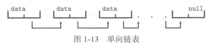

+ 双向链表：每项指向它的前驱与后继

  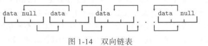

+ 循环链表：最后一项指向第一项

  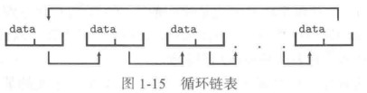

链表：允许不同大小项；插入删除方便

缺点：遍历麻烦

堆栈：有序，后进先出原则。压入和弹出。

队列：先进先出

#### 1.10.2 树

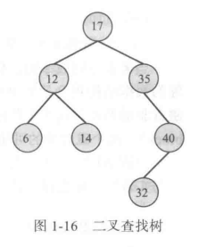

树( tree）是一种数据结构，可以表示数据层次。树结构的数据值可按父-子关系连接起来。对于一般树(general tree),父结点可有多个子结点。对于二叉树(binary tree)，父结点最多可有两个子结点,即左子结点（left child)和右子结点（rightchild)。二叉查找树(binary search tree)还要求对两个子结点进行排序,如左子结点≤右子结点。图 1-16为一个二叉查找树的例子。当需要对一个二叉查找树进行查找时，最坏性能为O(n)(请想一想这是为什么)。为了纠正这种情况，我们可以通过算法来创建平衡二叉查找树(balanced binary search tree)。这样，包含n个项的树最多只有lg n层，这可确保最坏性能为O(lg n)。在5.7.1节中，我们将会看到，Linux在CPU 调度算法中就使用了平衡二叉查找树。

#### 1.10.3 哈希函数与哈希表

哈希函数( hash function)将一个数据作为输入，对此进行数值运算，然后返回一个数值。该值可用作一个表(通常为数据组）的索引，以快速获得数据。虽然在最坏情况下从大小为n的列表中查找数据项所需的比较会是O(n)，但是采用哈希函数来从表中获得数据可能只有O(1)，这与具体实现有关。由于性能关系，哈希函数在操作系统中用得很广。

哈希函数有一潜在问题:两个输入可能产生同样的输出值，即它们会链接到列表的同一位置。哈希碰撞( hash collision)可以这样处理:在列表位置上可以存放一个链表，以便将具有相同哈希值的所有项链接起来。当然，碰撞越多，哈希函数的效率越低。

**哈希函数的另一用途是实现哈希表( hash map)，即利用哈希函数将键( key)和值( value)关联起来。例如，可将键operating映射到值system。有了这个映射，就可将哈希函数应用于键，进而从哈希表中获得对应值(图1-17)**。例如，现有用户名称映射到用户密码。用户认证可以这样进行:用户输入他的用户名称和密码;将哈希函数应用于用户名称，以获取密码;获取密码再与用户输入的密码进行比较,以便认证。

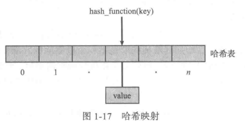

#### 1.10.4 位图

位图( bitmap）为n个二进制位的串，用于表示n项的状态。例如，假设有若干资源,每个资源的可用性可用二进制数字来表示：0表示资源可用，而1表示资源不可用(或相反)。位图的第i个位置的值与第i个资源相关联。例如，现有如下位图:
$001011101$
第2、4、5、6和8个资源是不可用的，第0、1、3和7个资源是可用的。

当考虑空间效率时，位图优势明显。如果所用的布尔值是8位的而不是1位的，那么最终的数据结构将会是原来的8倍。因此，当需要表示大量资源的可用性时，通常采用位图。磁盘驱动器就是这么工作的。一个中等大小的磁盘可以分成数千个单元，称为**磁盘块**( diskblock)。每个磁盘块的可用性就可通过位图来表示。

数据结构广泛用于实现操作系统。因此，除了这里讨论的一些数据结构，在分析内核算法与实现时，也会讨论其他的数据结构。

> Linux内核数据结构
>
> Linux内核所用的数据结构有源码。头文件<linux/list.h>包括内核所用的链表数据结构的实现细节。**Linux的队列称为kfifo**，**源代码的目录kernel的文件kfifo.c包含它的实现**。**Linux通过红黑树提供了平衡二分查找树的实现，头文件<linux/rbtree.h>包括它的细节**。

### 1.11 计算环境

#### 1.11.1 传统计算

桌面计算机等。服务器、笔记本电脑、远程访问。

#### 1.11.2 移动计算

便携与轻巧。

#### 1.11.3 分布计算

**分布式系统是物理上分开的、可能异构的、通过网络相联的一组计算机系统，可供用户访问系统维护的各个资源**。共享资源的访问可提高计算速度、功能、数据可用性及可靠性。有的操作系统将网络访问简化为文件访问，而网络细节则包含在网络接口驱动程序中;而其他的操作系统则让用户自己调用网络功能。通常，系统对这两种模式都会支持，**如FTP和NFS**。构建分布式系统的协议可以极大影响系统的实用和普及。

简单地说，**网络(network)就是两个或多个系统之间的通信路径**。分布式系统通过网络提供功能。**由于通信协议、节点距离、传输媒介的不同，网络也会不同**。**传输控制协议/网间协议（Transport Control Protocol/Internet Protocol，TCP/IP)是最为常用的网络协议，为因特网提供了基础架构。大多数的操作系统都支持TCP/IP，包括所有通用协议**。有的系统支持专用协议，以满足特定需求。对于操作系统而言，一个网络协议只是需要一个接口设备（如网络适配器)，通过驱动程序以便管理它以及处理数据的软件。这些概念后面会加以讨论。

网络可以根据节点之间的距离来划分。**局域网**(Local-Area Network，LAN)位于一个房间、一栋大楼或一所校园。**广域网**（ Wide-Area Network，WAN)通常用于联接楼宇、城市或国家。例如，一个全球性的公司可以用WAN将其全球内的办公室联接起来。这些网络可以采用单个或多个协议。不断出现的新技术也带来新的网络类型。例如，**城域网**( Metropolitan-Area Network，MAN)可以将一个城市内的楼宇连接起来。蓝牙和802.11设备采用无线技术，实现在数米内的无线通信，进而创建了个人局域网（ Personal-AreaNetwork ，PAN)，以连接电话和耳机或连接智能手机和桌面计算机。

网络的连接媒介同样很多，它们包括铜线、光纤、卫星之间的无线传输、微波和无线电波。当计算设备连接到手机时，就创建了一个网络。即使非常近距离的红外通信也可用来构建网络。总之，无论计算机何时通信，它们都要使用或构建一个网络。这些网络的性能和可靠性各不相同。

有的操作系统不但提供网络连接，而且进一步拓广了网络和分布式系统的概念。网络操作系统(network operating system)就是这样一种操作系统，它提供跨网络的文件共享、不同计算机进程的消息交换等功能。虽然运行网络操作系统的计算机知道有网络且能与其他联网的计算机进行通信，但是相对于网络上的其他计算机而言却是自治的。分布式操作系统提供较少的自治环境。不同的计算机紧密通信，以致于好像只有一个操作系统控制整个网络。

#### 1.11.4 客户机-服务器计算

许多现代操作系统可作为服务器系统，以满足客户机系统的请求。这种形式的专用分布式系统称为客户机-服务器系统。

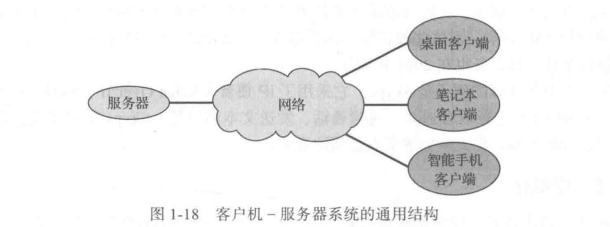

服务器系统可大致分为计算服务器和文件服务器:

+ **计算服务器系统（ compute-server system)提供接口**，以便客户发送请求以执行操作(如读数据)。相应地，服务器执行操作，并发送结果到客户机。例如，如果一个服务器运行数据库,那么就可响应客户机的数据请求。
+ **文件服务器系统( file-server system)提供文件系统接口**，以便客户机可以创建、更新、访问和删除文件。例如，一个Web服务器可以发送文件到运行Web浏览器的客户机。

#### 1.11.5 对等计算

分布式系统另一结构是**对等系统模型**(Peer to Peer, P2P)，这个模型并不区分客户机与服务器。所有系统节点对等，每个节点都可作为客户机或服务器。

一个节点在加入对等系统时，就应首先加入对等网络。节点一旦加入对等网络，可以为其他节点提供服务。

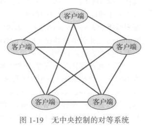

+ 通过网络集中查询服务来注册服务。
+ 提供发现协议，以允许节点发现其他节点服务。

提供文件共享服务的对等网络在20世纪90年代后期很受欢迎，如 Napster 和 Gnutella，可让对等节点互相交换文件。Napster系统采用类似上述的第一种方法:一个集中服务器维护存储在Napster网络上对等节点的所有文件的索引，而对等节点之间进行文件交换。Gnutella系统采用类似上述的第二种方法:一个客户机向系统的其他节点广播文件请求，能够服务请求的节点直接响应请求。文件交换的未来发展并不明朗，因为对等网络可以用于传播有产权保护的资料（如音乐)，而这些授权资料的传播是有法律限制的。值得一提的是，Napster 已陷入侵权案件，其服务也在2001年关停。

另一个对等计算的例子是Skype。它采用了**IP语音**( Voice Over IP，VoP)技术，客户可以在 Internet上进行语音通话、视频通话、发送文本消息等。Skype采用了混合方式：它有集中登录服务器，也支持分散节点之间的通信。

#### 1.11.6 虚拟化

虚拟化是一种软件技术，用于实现模拟。当原有CPU与现有CPU类型不同时，就可采用模拟：允许某一平台的操作系统可以运行在另一平台上。

解释：一种计算语言转换成中间形式或按高级形式来执行。

虚拟化：为某一CPU而编译的操作系统可以运行在为另一相同CPU而编译的操作系统上。

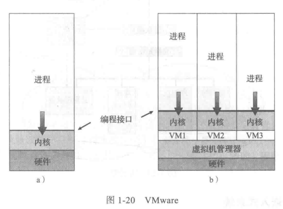

#### 1.11.7 云计算

云计算可以通过网络提供计算、存储甚至应用程序等服务。它是虚拟化技术的延伸。例如，亚马逊有数百万的虚拟机。

云计算实际上有许多类型,包括如下:

+ 公云(public cloud)。只要愿意为服务付费就可以使用的云。
+ 私云（private cloud)。公司自己使用自己的云。
+ 混合云( hybrid cloud)。有公云部分也有私云部分的云。
+ 软件即服务(Software as a Service，SaaS)。可通过Internet使用的应用程序(如文字处理程序或电子表格程序)。
+ 平台即服务( Platform as a Service，PaaS)。可通过Internet而为应用程序(如数据库服务器）使用的软件堆栈。
+ 基础设施即服务( Infrastructure as a Service，laaS)。可通过Internet使用的服务器或存储(如用于生产数据备份的存储)。

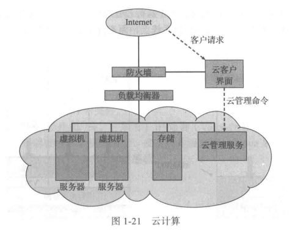

#### 1.11.8 实时嵌入式系统

嵌入式计算机是目前最为普遍的计算机。从汽车引擎和制造机器人，到录像机和微波炉，到处可以找到它们的身影。它们往往具有特定任务，运行系统通常很简单，因此操作系统提供了有限的功能。通常，**它们很少有甚至没有用户界面，主要关注监视和管理硬件设备，如汽车引擎和机器手**。

这些嵌入式系统差别相当大。有的是通用计算机，具有标准的操作系统如Linux，并运行专用应用程序来实现功能。还有的硬件设备具有专用的嵌入式操作系统，以提供所需功能。此外，还有其他的硬件设备，不采用操作系统，而采用**专用集成电路**（ ApplicationSpecific Integrated Circuit，ASIC)来执行任务。

嵌入式系统的使用继续扩大。无论是作为独立单元还是作为网络或Web 的组件，这些设备的性能也在增强。现在，整个房屋可以由计算机来控制，这样一台中心计算机，无论是通用计算机还是嵌入式计算机，可以控制取暖、照明、报警甚至咖啡机等。通过Web访问,房主可告诉房子在他回家之前加好温度。将来，冰箱也可能在发现牛奶没有时，通知食品杂货店送货。

嵌入式系统几乎总是采用实时操作系统( real-time operating system)。当处理器执行或数据流动具有严格时间要求时，就要使用实时系统，通常用作特定应用的控制设备。计算机从传感器获得数据，接着分析数据，然后通过控制调整传感器输入。科学试验的控制系统、医学成像系统、工业控制系统和有些显示系统等，都是实时系统。有些汽车喷油系统、家电控制器和武器系统等也是实时系统。

实时系统具有明确的、固定的时间约束。处理必须在固定时间约束内完成，否则系统就会出错。如果机器手在打坏所造汽车之后才停止，那么就不行了。只有在时间约束内返回正确结果，实时系统的运行才是正确的。与之不同的是，分时系统只是要(而不是一定）响应快，而批处理系统则没有任何时间约束。

第5章讨论操作系统如何实现实时功能的调度。第9章讨论实时计算的内存管理设计。最后，第16章和第17章讨论Linux和 Windows 7操作系统的实时组件。

### 1.12 开源操作系统

**开源操作系统**具有源码，而非只有编译过的二进制码。

Linux是开源的，Windows是闭源的，MAC OS X和iOS操作系统采用一种混合方式：开源的内核Darwin和闭源的专用组件。

逆向工程：二进制码到源码。通过阅读源码，学生可以修改操作系统。

#### 1.12.1 历史

在现代计算机初期，软件是开源的。MIT的Tech Model Railrod Club的最初骇客，到用户群等。

Richard Stallman于1983年设立了GNU项目，以创建一个免费的、开源的、兼容UNIX的操作系统。1985年，他发表了GNU宣言，主张软件应该是免费的和开源的，他设立了自由软件基金会(Free Software Foundation, FSF)，以鼓励自由交流软件源码和免费试用软件。FSF对软件施加著佐权，鼓励共享和改进。GNU通用公共许可证(GPL)，为著佐权的条文/

#### 1.12.2 Linux

GNU/Linux是开源操作系统的范例。GNU项目开发了许多与UNIX兼容的工具，包括编译器、编辑器及其他实用程序，但从未发布内核。1991年，一位名叫Linus Torvalds的芬兰大学生，利用GNU编译器和工具，开发并发布了一个类似UNIX的简答内核，并邀请大家一起开发。

这样形成的GNU/Linux操作系统有数百个的不同发布和定制，有RedHat、Slackware和Ubuntu等。

#### 1.12.3 BSD UNIX

1978，源自AT&T的UNIX。

BSD UNIX有许多发布，有FreeBSD，NetBSD，OpenBSD和Dragonfly BSD。源码位于`/usr/src`下。内核源码在`/usr/src/sys`下。

#### 1.12.4 Solaris

此系统为Sun的商用、基于UNIX的操作系统。最初，SUN的SunOS操作系统。1991年，SUN的SunOS操作系统是基于BSD UNIX的。1991年，SUN移到AT&T的System V UNIX。

### 1.13 小结

操作系统是管理计算机硬件并提供应用程序运行环境的软件。操作系统最为直观之处或许是它提供的用户与计算机系统的界面。

为了让计算机执行程序，程序应在内存中。内存是唯一的、处理器可以直接访问的、大容量的存储区域。内存为字节数组，其容量为数百万到数十亿。每个内存字节都有地址。内存通常是易失性存储，关闭或失去电源就会失去内容。大多数计算机系统都提供了外存，以扩充内存。外存提供了一种非易失存储，可长久保存大量数据。最常用的外存是磁盘，它提供数据和程序的存储。
根据速度和价格，计算机系统的不同存储系统可按层次来组织。层次越高，价格越贵,但也越快。随着从层次结构的由上向下的移动，每个字节的价格通常会降低，但是访问时间通常会增加。

计算机系统的设计有多种不同方法。单处理器系统只有一个处理器，而多处理器系统包含两个或更多处理器，并共享内存与外设。最为常见的多处理器设计技术为对称多处理器技术( SMP)，其中所有处理器可以视为对等，而且彼此独立运行。集群系统是一种特殊的多处理器系统，它是通过局域网连接的多个计算机系统组成的。

为了充分利用CPU，现代操作系统采用多道程序设计:允许多个作业同时位于内存,从而保证CPU总有一个作业可以执行。分时系统是多道程序系统的扩展，它采用调度算法，以快速切换作业，好像每个作业同时执行。
操作系统必须确保计算机系统的正确运行。为了防止用户干预系统的正常运行，硬件会有两种模式:用户模式和内核模式。许多指令(如IO指令和停机指令）都是特权的，只能在内核模式下执行。操作系统驻留的内存也应加以保护，以防止用户程序修改。定时器可以防止无穷循环。这些工具是操作系统使用的基本单元。

学习操作系统，一些开源的网站：http://dmoz.org/Conputers/Software/Operating_Systems/Open_Source/。

**进程(或作业)是操作系统的基本工作单元。**进程管理包括创建和删除进程、提供与其他进程通信和同步机制。操作系统管理内存，以跟踪内存的哪部分被使用以及被谁使用。操作系统还负责动态分配和释放内存空间。操作系统也管理存储空间，包括提供文件系统来管理文件和目录,以及管理大容量存储器设备的空间。

操作系统也应注重本身及其用户的保护和安全问题。保护措施用来控制进程或用户访问计算机系统资源。安全措施用来抵御计算机系统受到的来自外部或内部的攻击。

操作系统使用了一些常用数据结构，如列表、堆栈、队列、树、哈希函数、映射和位图等。

此计算环境有很多。传统计算环境为桌面PC和笔记本PC，通常连到计算机网络。移动计算环境为手持智能手机和平板电脑，这些设备具有专门的特点。分布式系统允许用户共享通过网络连接的、在地理位置上分散的计算机资源。服务的提供可采用客户机/服务器模式，也可采用对等模式。虚拟化技术可将一台计算机硬件虚拟化成多个不同执行环境。云计算采用分布式系统，将服务抽象成云，以便远方用户也可访问资源。实时操作系统用于嵌入式环境,如消费设备、汽车和机器人。

免费软件运动创建了数千个开源软件项目，包括操作系统。有了这些项目，学生可以通过源码来学习，可以修改和测试程序，帮助查错和纠错，研究成熟的、功能强大的操作系统、编译器、工具、用户界面及其他类型的程序。

### 习题答案

#### 1.1

a.窃取或者复制用户的程序或数据；没有合理的预算来使用资源。

b.应该不行，因为人类设计的任何保护机制都会不可避免的被另外的人所破译。

#### 1.2

a.内存和CPU资源，外存，网络带宽

b.内存和CPU资源

c.功率消耗，内存资源

#### 1.3

## 第二章 操作系统结构

### 2.1 操作系统提供的服务

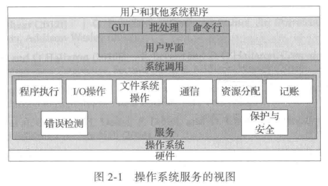

**用户界面：**包括命令行界面(CLI)，采用文本命令，用某一方法输入；批处理界面(batch interface)

